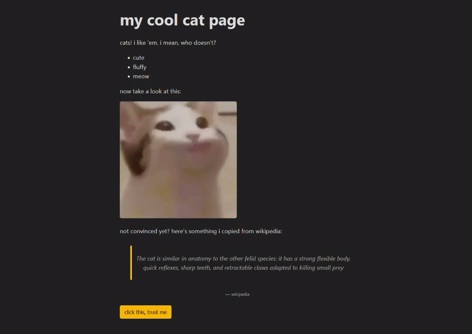

# React - CatPaws

A React component library for adding a cat paw overlay to your web app.



## Install & Use

```
npm install @drhaid/react-cat-paws
```

Include the `<CatPaws/>` component in your application.

### Component Props
|name|default|description|
|---|---|---|
|fillScreen|`false`|If `true` then the CatPaws canvas will fill the entire screen instead of just its parent container. |
|onClose|`undefined`|Handler for the close button. Only renders the button if a handler is defined.|

### Example implementation
```typescript
const App = () => {
  const [showCatPaws, setShowCatPaws] = useState(false);

  return (
    <> 
      <p>Hello World!</p>
      
      <button onClick={() => setShowCatPaws(true)}> click me! </button>
      {showCatPaws && 
        <CatPaws 
          onClose={() => setShowCatPaws(false)}
          fillScreen
        />}
    </>
  );
}
```

---
This project is inspired by the cat Easter egg by Google: https://g.co/kgs/wk2hPY  
However, while heavily inspired, all images were painted by me to match Google's style.

Uses [Parcel](https://parceljs.org/) to build and package the React library.

